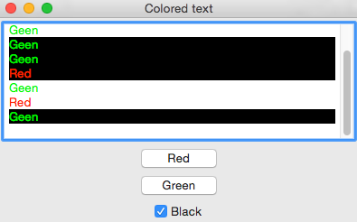

# Different colors in wxPython wxTextCtrl 

### Usage

    git clone https://github.com/0x8BADFOOD/python-experiments.git
    cd python-experiments/GUI-wx-textctrl-color
    chmod +x wxtextctrl.py
    ./wxtextctrl.py

### Result

